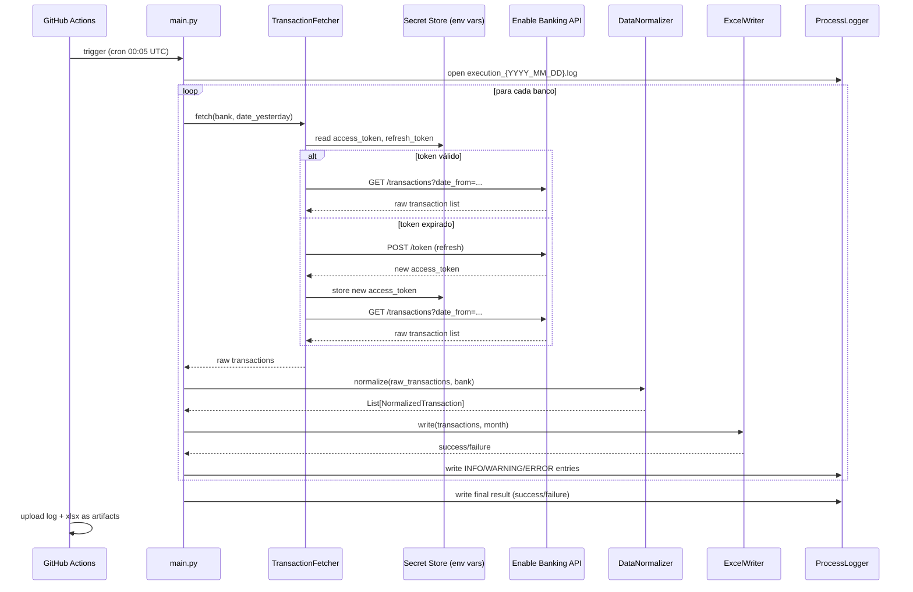

# Design Document: Enable Banking API Integration

## Overview

Este documento describe el diseño técnico del flujo automatizado de obtención y persistencia de movimientos bancarios diarios. El sistema conecta con cuatro entidades financieras (ING, Sabadell, Revolut y MyInvestor) a través de la [Enable Banking API](https://enablebanking.com/docs/api/), normaliza los movimientos del día anterior y los persiste en archivos Excel mensuales (`.xlsx`). El flujo se ejecuta de forma desatendida una vez al día mediante un cron de GitHub Actions, sin interfaz de usuario.

### Principios de Diseño

- **Seguridad primero**: ningún secreto, token ni credencial se almacena en código o archivos versionados; todo pasa por GitHub Actions Secrets / variables de entorno.
- **Precisión financiera**: todos los importes se manejan con `decimal.Decimal` (Python), nunca con `float`.
- **Resiliencia por entidad**: el fallo de una entidad bancaria no detiene el procesamiento de las demás.
- **Observabilidad**: cada paso queda registrado en un fichero de log diario con nivel y marca de tiempo ISO 8601.
- **Sin estado distribuido**: el único estado persistente son los archivos `.xlsx` y los tokens en GitHub Actions Secrets; no se usa base de datos.

---

## Architecture

El sistema se organiza en una pipeline lineal de cuatro componentes Python más un orquestador de GitHub Actions:

```
GitHub Actions Cron (00:05 UTC)
        │
        ▼
┌───────────────────────────────────────────────────────┐
│                   main.py  (orquestador)               │
│                                                        │
│  para cada banco en [ING, Sabadell, Revolut, MyInvestor]│
│  ┌─────────────────────────────────────────────────┐   │
│  │  1. TransactionFetcher  ──►  raw transactions   │   │
│  │  2. DataNormalizer      ──►  NormalizedTx list  │   │
│  │  3. ExcelWriter         ──►  .xlsx update       │   │
│  └─────────────────────────────────────────────────┘   │
│                                                        │
│  ProcessLogger (transversal, todos los componentes)    │
└───────────────────────────────────────────────────────┘
        │
        ▼
   Artifacts (log + xlsx)
   uploaded to GitHub Actions
```

### Diagrama de secuencia (flujo por entidad)



---

## Components and Interfaces

### 1. `TransactionFetcher`

**Responsabilidad**: autenticarse con la Enable Banking API y recuperar los movimientos del día anterior para una entidad concreta.

**Módulo**: `src/fetcher.py`

```python
class TransactionFetcher:
    def __init__(self, bank: str, secret_store: SecretStore) -> None: ...

    def fetch_transactions(self, date_from: date, date_to: date) -> list[dict]:
        """
        Devuelve la lista de transacciones crudas (dicts) devueltas por la API
        para el rango de fechas indicado.
        Lanza BankAuthError si el token no puede renovarse.
        Lanza BankAPIError si la API devuelve un error HTTP.
        """
```

**Comportamiento de reintento**: se usa `tenacity` para exponential backoff en errores de red y respuestas 5xx / 429. Los errores 4xx de autenticación (401, 403) no se reintentan; se elevan inmediatamente como `BankAuthError`.

**Límites de reintento**: máximo 5 intentos, backoff inicial de 1 s, factor 2 (1 s → 2 s → 4 s → 8 s → 16 s), con jitter aleatorio.

---

### 2. `DataNormalizer`

**Responsabilidad**: transformar el payload crudo de la API al esquema interno normalizado.

**Módulo**: `src/normalizer.py`

```python
from dataclasses import dataclass
from decimal import Decimal
from datetime import date

@dataclass(frozen=True)
class NormalizedTransaction:
    fecha: date          # ISO 8601
    importe: Decimal     # precisión decimal exacta
    concepto: str        # cadena vacía si no está disponible
    banco: str           # nombre de la entidad

class DataNormalizer:
    def normalize(
        self,
        raw_transactions: list[dict],
        bank: str,
    ) -> list[NormalizedTransaction]:
        """
        Filtra movimientos con campos obligatorios ausentes (registra WARNING).
        Convierte importe a Decimal. Preserva el signo.
        Devuelve lista (puede ser vacía).
        """
```

**Mapeo de campos Enable Banking API → esquema normalizado**:

| Campo API (ejemplo)           | Campo normalizado | Notas                                     |
|-------------------------------|-------------------|-------------------------------------------|
| `booking_date` / `value_date` | `fecha`           | Preferir `booking_date`; fallback a `value_date` |
| `transaction_amount.amount`   | `importe`         | Convertir a `Decimal`; preservar signo    |
| `remittance_information`      | `concepto`        | String vacío si ausente                   |
| _(parámetro de llamada)_      | `banco`           | Nombre pasado como argumento              |

---

### 3. `ExcelWriter`

**Responsabilidad**: insertar los movimientos normalizados en el archivo Excel mensual, detectando duplicados.

**Módulo**: `src/excel_writer.py`

```python
class ExcelWriter:
    def __init__(self, output_dir: Path) -> None: ...

    def write(
        self,
        transactions: list[NormalizedTransaction],
        enable_summary: bool = False,
    ) -> None:
        """
        Determina el archivo movimientos_{YYYY_MM}.xlsx para cada movimiento.
        Crea el archivo con cabeceras si no existe.
        Detecta duplicados (fecha+importe+concepto+banco) → columna Estado = DUPLICATE | NORMAL.
        Conserva filas existentes.
        Recalcula hoja Resumen si enable_summary=True.
        Guarda y cierra el workbook solo si toda la escritura tuvo éxito.
        """
```

**Esquema de columnas del Excel**:

| Columna  | Tipo              | Notas                              |
|----------|-------------------|------------------------------------|
| Fecha    | `datetime.date`   | Formato YYYY-MM-DD en celda Excel  |
| Importe  | `Decimal`         | Almacenado como número en la celda |
| Concepto | `str`             |                                    |
| Banco    | `str`             |                                    |
| Estado   | `str`             | `NORMAL` o `DUPLICATE`             |

**Lógica de detección de duplicados**: al cargar el workbook, se construye un `set` de tuplas `(fecha, importe, concepto, banco)` a partir de las filas existentes. Cada nuevo movimiento se comprueba contra ese set antes de insertar la fila con el `Estado` apropiado.

---

### 4. `ProcessLogger`

**Responsabilidad**: escritura centralizada de entradas de log con nivel y marca de tiempo ISO 8601. Componente transversal usado por todos los demás.

**Módulo**: `src/logger.py`

```python
class ProcessLogger:
    def __init__(self, log_dir: Path) -> None: ...

    def info(self, component: str, bank: str | None, message: str) -> None: ...
    def warning(self, component: str, bank: str | None, message: str) -> None: ...
    def error(self, component: str, bank: str | None, message: str) -> None: ...
```

**Formato de entrada de log**:
```
2025-01-15T00:05:12Z [INFO]    TransactionFetcher [ING] Iniciando obtención de movimientos para 2025-01-14
2025-01-15T00:05:15Z [WARNING] DataNormalizer     [ING] Movimiento tx_001 excluido: campo 'fecha' ausente
2025-01-15T00:05:18Z [ERROR]   TransactionFetcher [Sabadell] Refresh token inválido o expirado
```

**Fichero de log**: `logs/execution_{YYYY_MM_DD}.log` — modo append, creado si no existe.

**Fallback a stderr**: si la escritura al fichero falla, los mensajes se emiten por `stderr`. Si `stderr` también falla, la ejecución continúa silenciosamente.

---

### 5. `SecretStore`

**Responsabilidad**: abstracción de lectura/escritura de credenciales desde variables de entorno.

**Módulo**: `src/secret_store.py`

```python
class SecretStore:
    def get(self, key: str) -> str:
        """Lanza MissingSecretError si la variable no está definida o está vacía."""

    def set(self, key: str, value: str) -> None:
        """
        Actualiza la variable de entorno en el proceso actual.
        En GitHub Actions, escribe mediante el comando de workflow
        `echo "KEY=VALUE" >> $GITHUB_ENV` para persistir el token renovado.
        """
```

**Variables de entorno requeridas** (una por banco):

```
ENABLEBANKING_CLIENT_ID
ENABLEBANKING_CLIENT_SECRET
ING_ACCESS_TOKEN
ING_REFRESH_TOKEN
SABADELL_ACCESS_TOKEN
SABADELL_REFRESH_TOKEN
REVOLUT_ACCESS_TOKEN
REVOLUT_REFRESH_TOKEN
MYINVESTOR_ACCESS_TOKEN
MYINVESTOR_REFRESH_TOKEN
```

---

### 6. `main.py` — Orquestador

**Responsabilidad**: punto de entrada del script; coordina todos los componentes, captura errores por entidad y determina el código de salida final.

```python
BANKS = ["ING", "Sabadell", "Revolut", "MyInvestor"]

def main() -> int:
    """Devuelve 0 si todos los bancos procesados con éxito, 1 si alguno falló."""
    failed = False
    for bank in BANKS:
        try:
            raw = fetcher.fetch_transactions(bank, yesterday, yesterday)
            normalized = normalizer.normalize(raw, bank)
            writer.write(normalized)
        except Exception as e:
            logger.error("main", bank, str(e))
            failed = True
    logger.info("main", None, f"Flujo finalizado: {'failure' if failed else 'success'}")
    return 1 if failed else 0
```

---

## Data Models

### `NormalizedTransaction`

```python
@dataclass(frozen=True)
class NormalizedTransaction:
    fecha:    date     # datetime.date
    importe:  Decimal  # decimal.Decimal
    concepto: str      # str, puede ser vacío
    banco:    str      # str, nombre entidad
```

### Clave de deduplicación

```python
DuplicateKey = tuple[date, Decimal, str, str]
# (fecha, importe, concepto, banco)
```

### Estructura del archivo Excel mensual

```
movimientos_{YYYY_MM}.xlsx
├── Sheet: "Movimientos"  (hoja principal, siempre presente)
│   ├── Row 1: [Fecha, Importe, Concepto, Banco, Estado]  ← cabeceras
│   └── Rows 2..N: datos
└── Sheet: "Resumen"  (opcional, si enable_summary=True)
    ├── Row 1: [Banco, Total Ingresos, Total Gastos]  ← cabeceras
    └── Rows 2..M: totales por banco
```

### Estructura del fichero de log

```
logs/execution_{YYYY_MM_DD}.log
```

Formato de cada línea:
```
{ISO8601_TIMESTAMP} [{LEVEL}]    {COMPONENT} [{BANK}|global] {MESSAGE}
```

---

## Correctness Properties

*A property is a characteristic or behavior that should hold true across all valid executions of a system — essentially, a formal statement about what the system should do. Properties serve as the bridge between human-readable specifications and machine-verifiable correctness guarantees.*

### Property 1: Renovación automática de Access Token

*For any* entidad bancaria cuyo Access Token haya expirado y cuyo Refresh Token sea válido, cuando el `TransactionFetcher` intenta obtener movimientos, SHALL renovar el Access Token automáticamente sin intervención manual y completar la llamada a la API con éxito.

**Validates: Requirements 1.4**

---

### Property 2: Aislamiento de fallos por entidad bancaria

*For any* conjunto de entidades bancarias donde al menos una falla (por token inválido, error HTTP u otro error irrecuperable), las entidades restantes SHALL ser procesadas hasta su finalización, y el log SHALL contener al menos una entrada de nivel `ERROR` con el nombre de la entidad fallida. El fallo de una entidad no debe propagar excepciones no manejadas que interrumpan el ciclo principal.

**Validates: Requirements 1.5, 2.4**

---

### Property 3: Cálculo correcto de la fecha del día anterior

*For any* fecha de ejecución D (representada como `datetime.date`), la función de cálculo de rango de consulta SHALL devolver `date_from = D - 1 día` y `date_to = D - 1 día`, de forma que para toda fecha válida del calendario el resultado sea el día inmediatamente anterior.

**Validates: Requirements 2.1**

---

### Property 4: Mapeo completo de campos normalizados

*For any* transacción cruda de la API con todos los campos obligatorios presentes, el `DataNormalizer` SHALL producir una `NormalizedTransaction` donde: `fecha` es una fecha válida en formato ISO 8601 (YYYY-MM-DD), `importe` es un `Decimal` con el valor y signo originales, `concepto` es el valor de la API si está presente o cadena vacía si está ausente, y `banco` es el nombre de la entidad pasado como argumento.

**Validates: Requirements 3.1, 3.4, 3.5**

---

### Property 5: Round-trip de precisión decimal sin pérdida

*For any* cadena que represente un valor monetario con hasta 10 dígitos decimales (e.g., `"-1234.5678901234"`), el proceso de conversión del `DataNormalizer` — leer la cadena y construir un `Decimal` — SHALL producir un `Decimal` que, al convertirse de vuelta a su representación canónica de cadena, sea idéntico al valor original, sin ninguna pérdida o distorsión por aritmética de punto flotante binario.

**Validates: Requirements 3.2**

---

### Property 6: Movimientos con campos obligatorios ausentes son excluidos

*For any* lista de transacciones crudas que contenga elementos con uno o más campos obligatorios (`fecha`, `importe`, `banco`) ausentes o nulos, el `DataNormalizer` SHALL excluir esos elementos del resultado y el lote de salida SHALL contener únicamente movimientos donde los tres campos obligatorios están presentes y tienen valores no nulos. El número de entradas `WARNING` en el log SHALL ser igual al número de movimientos excluidos.

**Validates: Requirements 3.3**

---

### Property 7: Inserción en el archivo mensual correcto y creación de cabeceras

*For any* lote de `NormalizedTransaction` donde los movimientos corresponden a uno o más meses distintos, el `ExcelWriter` SHALL insertar cada movimiento en el archivo `movimientos_{YYYY_MM}.xlsx` correspondiente al mes de su `fecha`. Si el archivo para un mes dado no existe previamente, SHALL ser creado con una hoja principal que contenga exactamente las cabeceras `Fecha`, `Importe`, `Concepto`, `Banco` y `Estado` en la primera fila.

**Validates: Requirements 4.1, 4.2**

---

### Property 8: La escritura en modo append preserva todas las filas existentes

*For any* archivo Excel mensual con N filas de datos existentes y cualquier lote de K movimientos nuevos (K ≥ 0), tras la llamada a `ExcelWriter.write()`, el archivo resultante SHALL contener al menos N filas de datos y cada una de las N filas originales SHALL seguir presente con sus valores de `Fecha`, `Importe`, `Concepto`, `Banco` y `Estado` inalterados.

**Validates: Requirements 4.4**

---

### Property 9: Detección y marcado consistente de duplicados

*For any* lote de movimientos que incluya uno o más pares con idéntica combinación `(fecha, importe, concepto, banco)` ya presente en el archivo, cada movimiento cuya clave `(fecha, importe, concepto, banco)` coincida con una fila preexistente SHALL tener `Estado = DUPLICATE`, y cada movimiento con una clave nueva SHALL tener `Estado = NORMAL`.

**Validates: Requirements 4.3**

---

### Property 10: Hoja Resumen refleja todos los movimientos acumulados del mes

*For any* archivo Excel mensual con datos de días previos más un nuevo lote de movimientos del día en curso, cuando `enable_summary=True`, el `ExcelWriter` SHALL calcular los totales de ingresos (`importe > 0`) y gastos (`importe < 0`) por banco usando aritmética `Decimal` exacta, y los totales en la hoja `Resumen` SHALL coincidir con la suma de todos los movimientos del mes (previos y nuevos) — no solo los del lote actual.

**Validates: Requirements 5.1, 5.2, 5.3**

---

### Property 11: El código de salida refleja el resultado global del flujo

*For any* ejecución del flujo sobre las cuatro entidades bancarias con resultados individuales de éxito o fallo, `main()` SHALL devolver el código de salida `0` si y solo si las cuatro entidades fueron procesadas sin errores irrecuperables; en cualquier otro caso SHALL devolver `1`.

**Validates: Requirements 2.5, 6.3**

---

### Property 12: Todas las llamadas a la API usan conexiones HTTPS

*For any* llamada HTTP realizada por el `TransactionFetcher` hacia la Enable Banking API (autenticación, renovación de token o consulta de transacciones), la URL de destino SHALL comenzar con `https://` y nunca con `http://`.

**Validates: Requirements 7.2**

---

### Property 13: Ningún secreto ni credencial aparece en texto plano en los logs

*For any* valor de Access Token, Refresh Token, client secret u otra credencial que pase por el sistema durante la ejecución, ninguna entrada escrita por el `ProcessLogger` en el fichero de log ni en `stderr` SHALL contener ese valor en texto plano, independientemente de si la credencial es válida, inválida o está ausente.

**Validates: Requirements 7.3, 7.4, 8.4**

---

### Property 14: Las entradas de log contienen todos los campos requeridos en todos los niveles

*For any* llamada al `ProcessLogger` — `info()`, `warning()` o `error()` — con cualquier combinación de `component`, `bank` y `message`, la línea resultante escrita al fichero de log SHALL contener: (a) una marca de tiempo parseable en formato ISO 8601, (b) el identificador de nivel (`INFO`, `WARNING` o `ERROR`), (c) el nombre del componente, (d) el nombre del banco si fue proporcionado, y (e) el texto del mensaje.

**Validates: Requirements 8.2, 8.3, 8.4**

---

### Property 15: El fichero de log se abre en modo append y preserva entradas previas

*For any* fecha de ejecución D para la que ya exista un fichero `execution_{D}.log` con M líneas, tras una nueva ejecución del flujo sobre la misma fecha, el fichero SHALL contener al menos M + 1 líneas, y las M líneas originales SHALL aparecer al principio del fichero en el mismo orden y con el mismo contenido que antes de la nueva ejecución.

**Validates: Requirements 8.1**

---

## Error Handling

### Estrategia general

El sistema adopta un modelo de **aislamiento por entidad**: el fallo en el procesamiento de un banco no interrumpe el ciclo de los demás. El orquestador registra el error, marca el resultado del banco como fallido y continúa.

### Tabla de condiciones de error

| Condición                                      | Componente          | Acción                                                                 | Log level |
|------------------------------------------------|---------------------|------------------------------------------------------------------------|-----------|
| Secret no disponible o vacío                   | SecretStore         | Lanza `MissingSecretError`; orquestador registra y salta entidad       | ERROR     |
| Refresh token expirado / inválido              | TransactionFetcher  | Registra error con nombre de entidad; detiene esa entidad              | ERROR     |
| Error de red en renovación de token            | TransactionFetcher  | Reintento con exponential backoff (máx. 5 intentos); si agota, ERROR  | WARNING → ERROR |
| HTTP 4xx (auth) de la API de transacciones     | TransactionFetcher  | No reintenta; registra error con código HTTP y entidad                 | ERROR     |
| HTTP 5xx / 429 de la API de transacciones      | TransactionFetcher  | Reintento con exponential backoff; si agota, ERROR                     | WARNING → ERROR |
| Respuesta vacía (0 movimientos)                | TransactionFetcher  | Registra aviso; continúa sin error                                     | WARNING   |
| Campo obligatorio ausente en movimiento        | DataNormalizer      | Excluye el movimiento; registra aviso con ID del movimiento            | WARNING   |
| Error de escritura en Excel                    | ExcelWriter         | No guarda el fichero; registra error; orquestador falla                | ERROR     |
| Error de escritura en fichero de log           | ProcessLogger       | Fallback a stderr; continúa ejecución                                  | —         |
| Algún banco falla durante el flujo             | main.py             | Continúa con los demás bancos; código de salida = 1 al final           | ERROR     |

### Códigos de excepción personalizados

```python
class BankAuthError(Exception): ...       # Token inválido / expirado
class BankAPIError(Exception): ...        # Error HTTP de la API
class MissingSecretError(Exception): ...  # Variable de entorno no disponible
class ExcelWriteError(Exception): ...     # Fallo al persistir el Excel
```

---

## Testing Strategy

### Enfoque dual: tests unitarios + tests basados en propiedades

Los tests unitarios cubren escenarios concretos, casos límite e integraciones entre componentes. Los tests de propiedades validan las propiedades universales definidas en la sección anterior usando datos generados aleatoriamente.

**Librería de property-based testing**: [`hypothesis`](https://hypothesis.readthedocs.io/) (Python).  
Cada test de propiedad se ejecuta con un mínimo de **100 iteraciones** (configurado mediante `@settings(max_examples=100)`).

### Estructura de tests

```
tests/
├── unit/
│   ├── test_normalizer.py        # ejemplos concretos, casos límite
│   ├── test_excel_writer.py      # creación de fichero, cabeceras, append
│   ├── test_fetcher.py           # mocks de API, flujo OAuth, retry
│   ├── test_logger.py            # formato de log, fallback a stderr
│   └── test_secret_store.py      # lectura de env vars, error si ausente
└── property/
    ├── test_prop_normalizer.py    # Properties 1, 2, 3
    ├── test_prop_excel_writer.py  # Properties 4, 5
    └── test_prop_logger.py        # Properties 6, 7
```

### Tests unitarios clave

| Test                                        | Componente        | Tipo     |
|---------------------------------------------|-------------------|----------|
| Token expirado → refresh automático         | TransactionFetcher | ejemplo  |
| Refresh token inválido → BankAuthError       | TransactionFetcher | ejemplo  |
| API devuelve 500 → reintento y backoff       | TransactionFetcher | ejemplo  |
| API devuelve 0 transacciones → WARNING log   | TransactionFetcher | ejemplo  |
| `concepto` ausente → campo vacío             | DataNormalizer    | ejemplo  |
| `fecha` ausente → movimiento excluido       | DataNormalizer    | ejemplo  |
| Crear Excel nuevo con cabeceras correctas   | ExcelWriter       | ejemplo  |
| Escritura interrumpida → no guarda fichero  | ExcelWriter       | ejemplo  |
| Log con credencial → credencial no aparece | ProcessLogger     | ejemplo  |
| Secret ausente → MissingSecretError         | SecretStore       | ejemplo  |

### Tests de propiedades

Cada test de propiedad referencia su propiedad del diseño en un comentario de etiqueta:

```python
# Feature: enablebanking-api-integration, Property 5: Round-trip de precisión decimal sin pérdida
@given(st.decimals(allow_nan=False, allow_infinity=False, min_value=Decimal("-1e10"), max_value=Decimal("1e10")))
@settings(max_examples=100)
def test_decimal_roundtrip(amount):
    ...
```

| Test de propiedad                                         | Propiedad | Librería   |
|-----------------------------------------------------------|-----------|------------|
| Renovación automática de Access Token expirado            | P1        | hypothesis |
| Aislamiento de fallos por entidad bancaria                | P2        | hypothesis |
| Cálculo correcto de fecha del día anterior                | P3        | hypothesis |
| Mapeo completo de campos normalizados                     | P4        | hypothesis |
| Round-trip de precisión decimal sin pérdida               | P5        | hypothesis |
| Movimientos con campos obligatorios ausentes son excluidos| P6        | hypothesis |
| Inserción en archivo mensual correcto + cabeceras         | P7        | hypothesis |
| Escritura append preserva filas existentes                | P8        | hypothesis |
| Detección y marcado consistente de duplicados             | P9        | hypothesis |
| Hoja Resumen refleja todos los movimientos del mes        | P10       | hypothesis |
| Código de salida refleja resultado global                 | P11       | hypothesis |
| Todas las llamadas a la API usan HTTPS                    | P12       | hypothesis |
| Ningún secreto aparece en texto plano en logs             | P13       | hypothesis |
| Entradas de log contienen todos los campos requeridos     | P14       | hypothesis |
| Fichero de log en modo append preserva entradas previas   | P15       | hypothesis |

### Dependencias de test

Las llamadas a la Enable Banking API se mockean con `unittest.mock.patch` / `responses` (librería). No se realizan llamadas reales a la API en el suite de tests.

### GitHub Actions — workflow de tests

```yaml
# .github/workflows/tests.yml
on: [push, pull_request]
jobs:
  test:
    runs-on: ubuntu-latest
    steps:
      - uses: actions/checkout@v4
      - uses: actions/setup-python@v5
        with: { python-version: "3.12" }
      - run: pip install -r requirements-dev.txt
      - run: pytest tests/ -v
```
